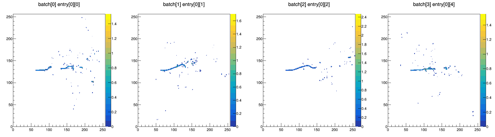

# simpledet

This is an extremely simplistic "readout" model which takes EdepSim input and produces "LArTPC images".

Currently, there is only one pseudo-readout mode which performs a 2D projection in the following way.

The images are made by dividing the edep line segments into small steps, representing point ionization.
The edep is drifted to a wire plane over some distance at a constant velocity.
The ionization spreads out into a 2D Gaussian pattern using a transverse diffusion pattern.
We pretend that the readout projects along the drift direction, producing a 2D image.

Eventually, want to implement a pseudo-readout for a wire-type readout, producing 3 planes.

## Example Scripts

In the `test` folder:

* `test_save2petastormdb.py`: converts EDepSim energy deposits into images using the projective pseuo-readout.
  Saves data into a petastorm DB.
* `test_dataloader.py`: shows example of loading a pytorch DataLoader to read data from a petastorm DB.

Example of a batch of electron images loaded in `test_dataloader.py`:

